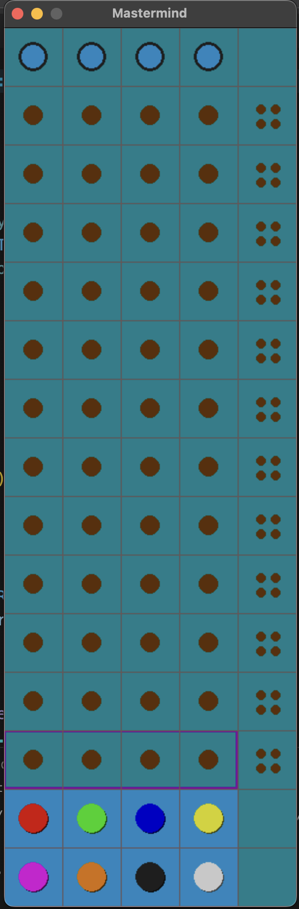
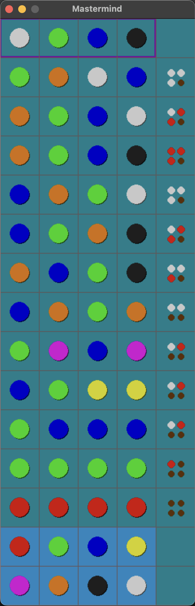

# Presenting the MVP For the SMART INDIA HACKATHON

- This repo can be considered as the Minimum Viable Product (MVP) for our main project

# Mastermind In Python Pygame

- Mastermind is a classic arcade code cracking game created in the 1970's

## RULES
The game is played using:

- a **_Decoding Board_**, with a shield at one end covering a row of four large holes, and twelve (or ten, or eight, or six) additional rows containing four large holes next to a set of four small holes;
- **_Code Pegs_** of six different colors, with round heads, which will be placed in the large holes on the board; and
- **_Key Pegs_**, some colored red (or black) and some white, which are flat-headed and smaller than the code pegs; they will be placed in the small holes on the board

## GAMEPLAY

- This is a Two-Five Player Game. Supposedly there a **TWO** players.
- Players decide in advance how many games they will play, which must be an even number. One player becomes the **_CodeMaker_**, the other the **_CodeBreaker_**.
- The **_CodeMaker_** chooses a pattern of four code pegs. 
- Players decide in advance whether duplicates and blanks are allowed. 
- If so, the **_CodeMaker_** may choose up to four same-colored code pegs or four blanks. 
- If blanks are not allowed in the code, the **_CodeBreaker_** may not use blanks in their guesses. 
- The **_CodeMaker_** places the chosen pattern in the four holes covered by the shield, visible to the **_CodeMaker_** but not to the **_CodeBreaker_**.

## OUTPUT

